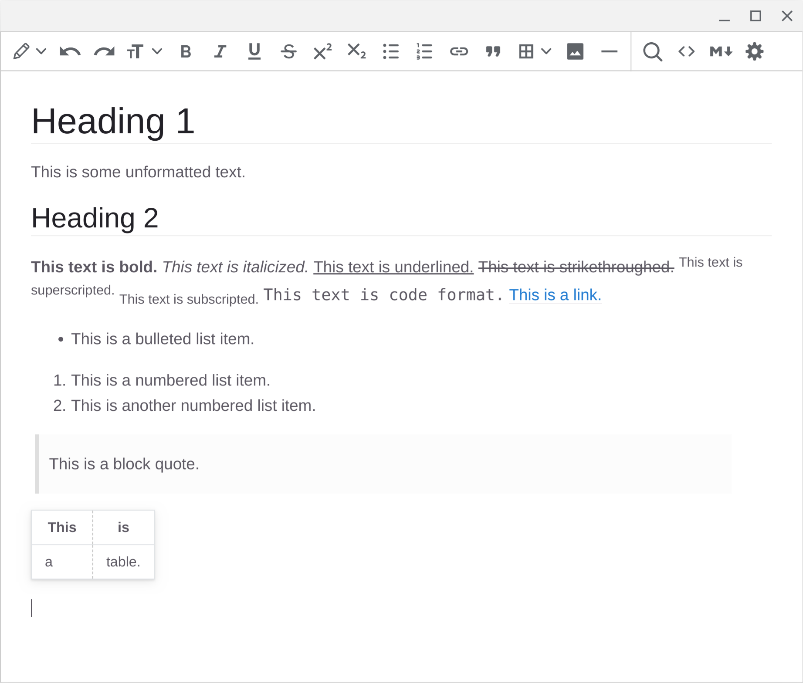

# tinyelectron

A simple and fast restricted rich-text and markdown editor using [Electron](https://www.electronjs.org/), [TinyMCE 5](https://github.com/tinymce/tinymce), and [Showdown](https://github.com/showdownjs/showdown) (via a modified [TinyMCE labs plugin](https://www.tiny.cloud/labs/markdown/)). Runs on Windows, macOS, Linux, and Chrome OS (via Crostini).

Forked and expanded on from [Moliman/tiny-electron](https://github.com/Moliman/tiny-electron) (original was [bmaranville/el-tiny-editor](https://github.com/bmaranville/el-tiny-editor)).

Features:

* Open and save files as markdown (MD), plain text (TXT), or restricted rich-text (HTML).
* Restricted rich-text support. Only headings, bold, italics, underline, strikethrough, superscript, subscript, bulleted lists, numbered lists, links, block quotes, code, tables, images, and horizontal lines are included. All other styling—e.g. font size, font color, spacing, alignment, etc.—is disabled and automatically removed.
* Editing and formatting keyboard shortcuts (e.g., ctrl+v for paste, ctrl+b for bold, ctrl+k for links, etc.).
* Partial support for live conversion of markdown into rich-text in rich-text editing mode. For example, typing `# Header title` will make an H1 header and typing `**This text is bold.**` will make the text bold. Markdown-to-rich-text does not currently work with links, tables, or images.
* Panes to view and edit the document as markdown or markdown. Bidirectional live editing between rich-text and markdown panes.
* Find and replace functionality in the rich-text pane.

Here is a screenshot of the editor:

To install dependencies and run:

`npm install`

`npm start`

To build executables:

`yarn dist`

To install as an application, run the appropriate executable (e.g., .exe, .deb) in the dist folder after building.

# Related

* [Typora](https://typora.io/)
* [Mark Text](https://github.com/marktext/marktext)
* [Zettlr](https://github.com/Zettlr/Zettlr)

