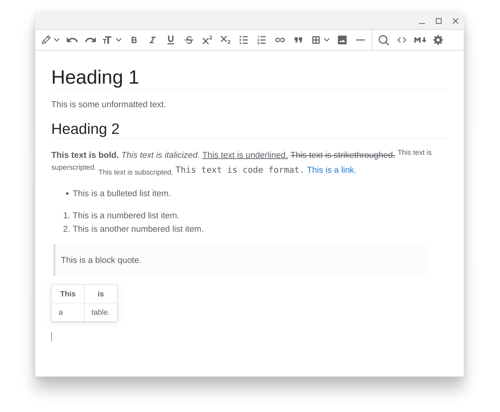

# tinyelectron

A simple and fast restricted rich-text editor. Uses [Electron](https://www.electronjs.org/) and [TinyMCE 5](https://github.com/tinymce/tinymce) and runs on all major desktop operating systems: Windows, macOS, Linux, and Chrome OS (via Crostini).

Forked from [Moliman/tiny-electron](https://github.com/Moliman/tiny-electron) (originally by [bmaranville/el-tiny-editor](https://github.com/bmaranville/el-tiny-editor)).

Features:

* Restricted rich-text support. Only headings, bold, italics, underline, strikethrough, superscript, subscript, bulleted lists, numbered lists, links, block quotes, code, tables, images, and horizontal lines are included. All other styling—including, e.g., font size, font color, spacing, alignment, etc.—is disabled and automatically removed.
* Editing and formatting keyboard shortcuts (e.g., ctrl+v for paste, ctrl+b for bold, ctrl+k for links, etc.).
* Partial support for while-typing conversion of basic markdown into rich-text. For example, typing "# header title" and enter will make an H1 header and typing "**This text is bold.**" and pressing space will bold the text.
* Panes to view and edit the document as HTML code or markdown.
* Find and replace functionality.
* Saves as HTML or plain text but future support for opening and saving as markdown planned.

Here is a screenshot of the editor:

To install dependencies and run:

`npm install`

`npm start`

To build executables:

`yarn dist`

To install as an application, run the appropriate executable (e.g., .exe, .deb) in the dist folder after building.

